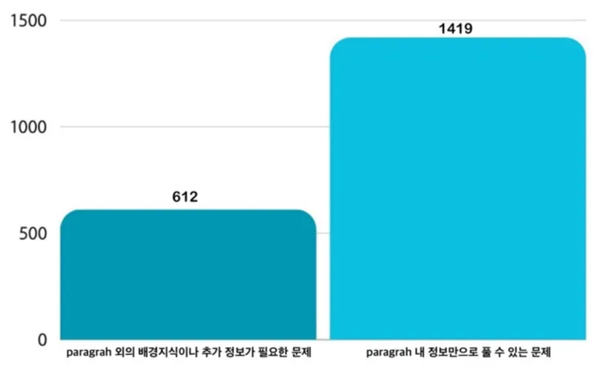
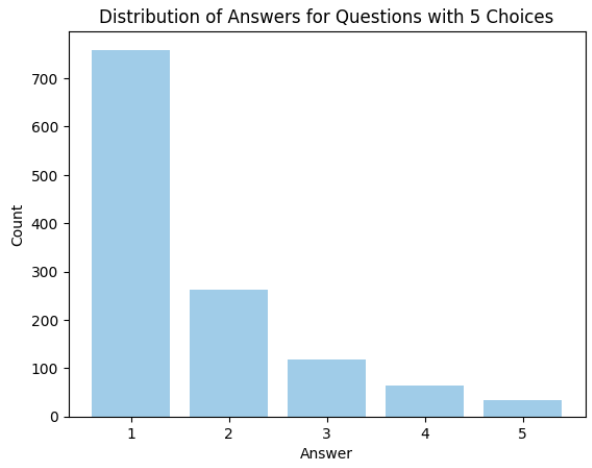
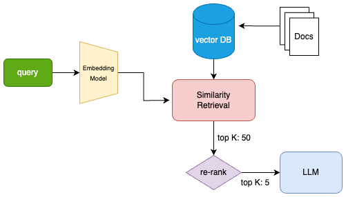
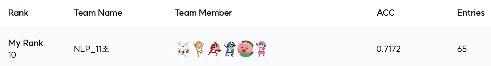

# Level 2-3. 수능형 문제 풀이 모델 생성

---

# **🔎 프로젝트 소개**

### **프로젝트 주제**

1. **수능형 문제 풀이 모델 생성**
2. **목적**
    
    : 한국어와 수능 시험의 특성을 이용하여 작은 규모의 언어 모델을 수능에 최적화된 모델로 만들기
    

### **데이터셋**

1. **데이터 구성**
    
    
    | **데이터 유형** | **설명** | **세부 내용/범주** |
    | --- | --- | --- |
    | **수능형 문제** | 수능과 유사한 문제 | 국어 / 사회(윤리, 정치, 사회) |
    | **KMMLU** | 한국사 관련 문제 | Korean History |
    | **MMMLU** | 고등학교 데이터에서 추출된 문제 | HighSchool 데이터 중 역사 / 경제 / 정치 / 지리 / 심리 |
    | **KLUE MRC** | 경제 및 다양한 사회 문제를 다루는 데이터 | 경제 / 교육산업 / 국제 / 부동산 / 사회 / 생활 / 책마을 |
2. **데이터셋 세부 정보**
    
    
    | **Header/Key** | **설명** |
    | --- | --- |
    | **id** | 데이터 고유 식별자 |
    | **paragraph** | 지문 |
    | **problems** | 문제 관련 정보 |
    | ㄴ **question** | 문제 질문 |
    | ㄴ **choices** | 선지 |
    | ㄴ **answer** | 정답 |
    | **question_plus** | 보기 |
3. **총 데이터 개수**
    
    
    | **Train 데이터 개수** | KMMLU / MMMLU(Ko) / KLUE MRC 데이터 중 **2031개** |
    | --- | --- |
    | **Test 데이터 개수** | 수능형 문제 + KMMLU / MMMLU(Ko) / KLUE MRC 데이터 총 **869개** |

### **평가 방법**

- **정확도(Accuracy)** = 모델이 맞춘 문제 수 / 전체 문제 수
<br>

# **👨🏻‍💻 팀원 소개 및 역할**

<div align='center'>

|권기태 [](https://github.com/starlike6617)|</img>|EDA, 모델 Research, Prompt Engineering(Zero-shot CoT 등), RAG|
|:-:|:-:|:-:|
|권유진 [](https://github.com/0618yujin)|</img>|EDA, 데이터 필터링 및 전처리, 프롬프트 연구|
|박무재 [](https://github.com/Mujae)|</img>|EDA, 프롬프트(CoT, 감정 호소, pythonic, XML), Trying Advanced RAG|
|박정미 [](https://github.com/imJeongmi)|</img>|EDA, 모델 Research, 프롬프트 연구 및 실험|
|이용준 [](https://github.com/elwhyjay)|</img>|PM, 모듈화, RAG pipeline 구현, Fine–tuning, 모델 Research, prompting(one-shot etc..)|
|정원식 [](https://github.com/wonsjeong)|</img>|EDA, 모델 Research, 시험지 형식 및 레이블링 툴 구현, 모델 실험 Pipeline 구현, Fine-tuning|

</div>
<br>

# 🦴 **프로젝트 구조**

```
level2-nlp-generationfornlp-nlp-11-lv3
├── data
│   ├── train.csv
│   ├── test.csv
│   ├── processed_wiki_ko.txt
│   ├── data_utils.py
│   └── view_and_label_data.ipynb
├── db             
│   ├── bm25_retriever
│   │   └── bm25.bin
│   └── vectorstore
│       ├── index.faiss
│       └── index.pkl
├── source                
│   ├── inference.py
│   ├── fine_tuning.py
│   ├── rag.py
│   ├── vllm_infer.ipynb
│   └── utils.py
│        
├── README.md
├── inference.sh
└── requirements.txt
```
<br>

# **⚒️** 프로젝트 수행 방법

1. **EDA**
    1. **학습 데이터셋 수동 레이블링**
        1. 필요 지식
            
            : paragraph에 포함된 정보만으로 문제를 해결할 수 있는지 여부를 판단
            
            - paragraph 외의 배경지식이나 추가 정보가 필요한 문제 (RAG 사용)
            - paragraph 내 정보만으로 풀 수 있는 문제 (RAG 미사용)
                
            <p align='center'>
                
            </p>
                
        2. 데이터 품질 점검
            
            : 각 데이터 구성 요소별로 저품질 데이터를 확인하고 개선 필요 여부를 분석
            
            | 지문(paragraph) 저품질 | 문제(question) 저품질 | 선택지(choices) 저품질 | 정답(answer) 저품질 |
            | --- | --- | --- | --- |
            | 지문의 내용 부실 및 이상 | 문제 내용의 부실 및 이상 | 문제와의 연계 부족 | 정답 오류 |
            | 문제 & 선택지 간의 연계 부족 | 오타 존재 | ‘\xa0’ 노이즈 존재  | 복수 정답 |
            | 지문에 문제가 포함 |  |  | 정답 없음 |
            | 지문이 문제와 동일 |  |  |  |
            | ‘밑줄’이 확인되지 않음 |  |  |  |
    2. **전처리**
        1. 데이터 필터링
            
            - 저품질 데이터 제거
            
                : **지문** 저품질(지문의 내용 부실 및 이상, 문제 & 선택지 간의 연계 부족), **문제** 저품질(문제 내용 부실 및 이상), **선택지** 저품질(문제와의 연계 부족) 데이터 제거
            
            - 저품질 데이터 수정
            
                : **정답** 저품질(정답 오류, 복수 정답, 정답 없음) 데이터 수정
        2. 정답 선지 분포 조정
            <p align='center'>
                
            </p>
            
            - 5지선다 중 정답이 ‘**1**’에 편중된 경향 확인
                : 4지선다 문제에 ‘정답 아님’ 선택지를 추가해 5지선다로 변경한 후, 정답이 1부터 5까지 고르게 분포하도록 randomint를 통해 데이터를 조정
    3. **데이터 버전**
        
        
        | **데이터 버전** | **설명** |
        | --- | --- |
        | v1 | 저품질 데이터 제거 |
        | v2 | v1 + 저품질 데이터 수정 |
        | v3 | v2 + 선지 분포 조정 |
2. **Inferenece**
    1. Logit/Generation Inference
        - Logit Inference: 마지막 출력의 Logit 값을 이용해 정답 후보들간의 확률을 구해 정답을 추론하는 방식. 빠른 추론가능
        - Generation Inference: LLM이 풀이를 생성후 후처리를 통해 정답을 정제하는 방식. CoT등 복잡한 추론이 가능해 성능향상이 기대되나 추론 속도가 느림
    2. vLLM
        - vLLM은 서버의 환경상 매우 제한적으로 사용됨. 특히 Ampere 이상의 Architecture를 요구하는 Flash Attention 2 이상을 사용하는 모델은 실험이 불가능하였음
3. **RAG**
    - RAG Pipeline
        
        <p align='center'>
            
        </p>
        
    - Retrieval 예시
        
        
        | Query | BM25 | Sentence BERT |
        | --- | --- | --- |
        | 미적인 것은 윤리적으로 좋은 것의 상징이다. 미적인 것은 다른 모든 사람들의 동의를 요구하며 요구해야 마땅하다 . 이때 우리의 마음은 쾌락의 단순한 감각적 수용을 넘어선 순화와 고양을 의식하며 , 다른 사람들의 가치도 그들이 지닌 판단력의 비슷한 준칙에 따라서 평가하게 된다. '다음을 주장한 사상가의 입장으로 가장 적절한 것은 ? | 인식론에서 합리론 (合理論, 합리주의 (合理主義) 또는 이성주의 (理性主義)는 이성을 지식의 제일의 근원으로 보는 견해를 말한다. 합리론에서의 진리의 기준은 감각적인 것이 아니라 이성적이고 연역적인 방법론이나 이론으로 정의된다. 합리론자는 … [인식론에 관한 문서] | 취미판단 ()은 이마누엘 칸트의 비판철학에서 미 판단 양식 일종으로서 미 인상 결정이 취미라고 간주하는 처지에서 하자(何者)를 아름답다거나 미에 관계하여 쾌감을 제공한다는 단정을 운위한다. 대상이 아름다운지 여부를 구별하려는 때 사람은 그 표상을 인식하고자 지성으로써 객관과 … [판단력 비판에 관한 문서] |
4. **Prompt Engineering**
    1. Baseline Prompt
        
        ```
        1, 2, 3, 4, 5 중에 하나를 정답으로 고르세요.
        ```
        
    2. Advanced Prompt
        - 명확한 역할 설정
            
            ```
            당신은 대한민국의 고등학교 3학년 수험생입니다. 수능 시험을 치르고 있으며, 최선을 다해 문제를 풀어야 합니다.
            ```
            
        - 풀이 방식 및 답변 형식 지정
            
            ```
            문제를 풀 때는 반드시 주어진 지문을 참고하세요. 질문을 이해하고, 모든 선택지를 꼼꼼히 검토하여 근거를 지문에서 찾아 정답을 고르세요. 
            ```
            
            ```
            선택지 1, 2, 3, 4, 5 중 정답을 찾아 정답을 외친 후 풀이해주세요.
            ```
            
        - 감정적 호소
            
            ```
            이 문제는 제 입시에 매우 중요하니, 꼭 정확한 답을 찾아주세요.
            ```
            
        - AI 자극
            
            ```
            한국의 가장 똑똑한 학생들도 어려워하는 문제들이라 인공지능이 풀기에는 매우 까다로울 수 있으나 최선을 다해주세요.
            ```
            
        - One-shot prompt
            
            ```
            {지문} {질문} {선택지} {풀이} {정답} 순으로 예시를 base prompt 전위에 삽입.
            ```
<br>

# **💥 결과**

| 모델 | 결과(Test Data) | 비고 |
| --- | --- | --- |
| Qwen/Qwen2.5-Coder-32B-Instruct-GPTQ-Int4 | 0.6037 | Logit Inference |
| Qwen/Qwen2.5-Coder-32B-Instruct-GPTQ-Int4 | 0.7166 | Generation Inference, CoT |
| Qwen/Qwen2.5-14B-Instruct | 0.7074 | Generation Inference, 지문에서만 답 찾기, 지문에서 답을 못 찾은 문제에 대하여 LLM 지식 이용하여 풀기, GPU Memory 한계로 못 푼 문제는 Qwen/Qwen2.5-7B-Instruct로 풀기 |
| Qwen/Qwen2.5-14B-Instruct | 0.7097 | Generation Inference, 모든 문제를 LLM의 지식을 이용하여 풀기 |
| Qwen/Qwen2.5-14B-Instruct | 0.7235 | Logit Inference |
| Qwen/Qwen2.5-7B-Instruct | 0.6152 | Generation Inference, 모든 문제를 LLM의 지식을 이용하여 풀기 |
| Qwen/Qwen2.5-7B-Instruct | 0.6152 | Logit Inference |
| google/gemma-2-9b-it | 0.5991 | Logit Inference, CoT |
| google/gemma-2-9b-it | 0.6037 | SFT, Logit Inference, CoT |
| NCSOFT/Llama-VARCO-8B-Instruct | 0.6175 | Logit Inference, CoT |
| NCSOFT/Llama-VARCO-8B-Instruct | 0.5945 | Logit Inference, RAG |
| yanolja/EEVE-Korean-Instruct-10.8B-v1.0 | 0.6590 | Logit Inference,CoT |
| yanolja/EEVE-Korean-Instruct-10.8B-v1.0 | 0.6498 | Logit Inference, One-shot |
| Saxo/Linkbricks-Horizon-AI-Korean-Mistral-Nemo-sft-dpo-12B | 0.6221 | Generation Inference, mistralai/Mistral-Nemo-Base-2407을 기반으로 SFT -> DPO Fine-tuning 된 한국어 모델, 모든 문제를 LLM의 지식을 이용하여 풀기 |
| upstage/SOLAR-10.7B-v1.0 | 0.5115 | Logit inference |
| LGAI-EXAONE/EXAONE-3.0-7.8B-Instruct | 0.5908 | Generation Inference, Baseline Prompt |
| LGAI-EXAONE/EXAONE-3.0-7.8B-Instruct | 0.6184 | Generation Inference, Advanced Prompt |

### **리더보드 최종 결과**

<p align='center'>
  
</p>
